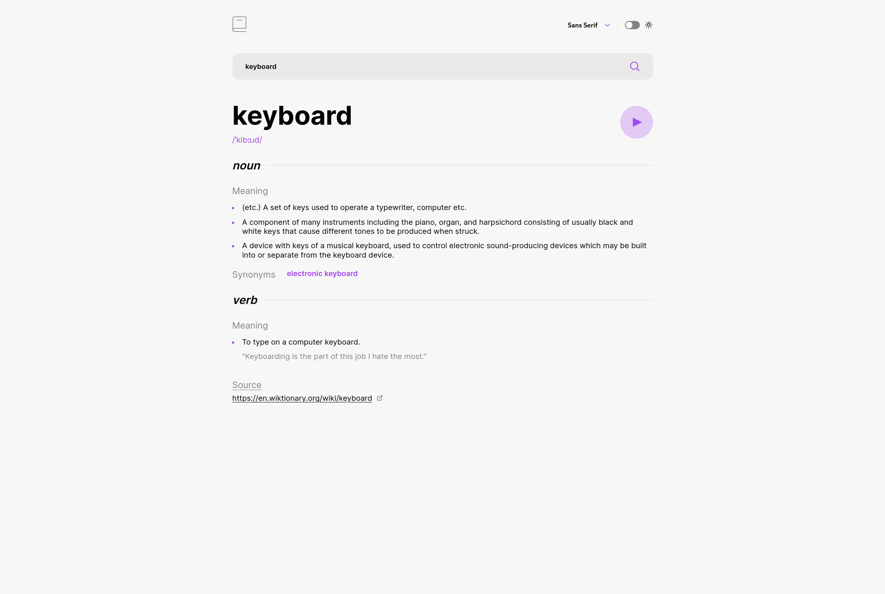

# Frontend Mentor - Dictionary web app solution

This is a solution to the [Dictionary web app challenge on Frontend Mentor](https://www.frontendmentor.io/challenges/dictionary-web-app-h5wwnyuKFL). Frontend Mentor challenges help you improve your coding skills by building realistic projects. 

## Table of contents

- [Overview](#overview)
  - [The challenge](#the-challenge)
  - [Screenshot](#screenshot)
  - [Links](#links)
- [My process](#my-process)
  - [Built with](#built-with)
  - [Useful resources](#useful-resources)
- [Author](#author)

## Overview

### The challenge

Users should be able to:

- Search for words using the input field
- See the Free Dictionary API's response for the searched word
- See a form validation message when trying to submit a blank form
- Play the audio file for a word when it's available
- Switch between serif, sans serif, and monospace fonts
- Switch between light and dark themes
- View the optimal layout for the interface depending on their device's screen size
- See hover and focus states for all interactive elements on the page

### Screenshot

### Links

- Solution URL: [Add solution URL here](https://your-solution-url.com)
- Live Site URL: [Add live site URL here](https://your-live-site-url.com)

## My process

### Built with

- Semantic HTML5 markup
- CSS custom properties
- Flexbox
- Mobile-first workflow
- [React](https://reactjs.org/) - JS library
- CSS modules
- [Axios](https://axios-http.com/docs/intro) - For data fetching

### Useful resources

- [Axiois](https://axios-http.com/docs/intro) - Axios docs which helped with making API calls.
- [Dictionary API](https://dictionaryapi.dev/) - Free API to get the word definitions.

## Author

- Frontend Mentor - [@mkulemeka](https://www.frontendmentor.io/profile/mkulemeka)
- Twitter - [@yourusername](https://www.twitter.com/kahle01)

